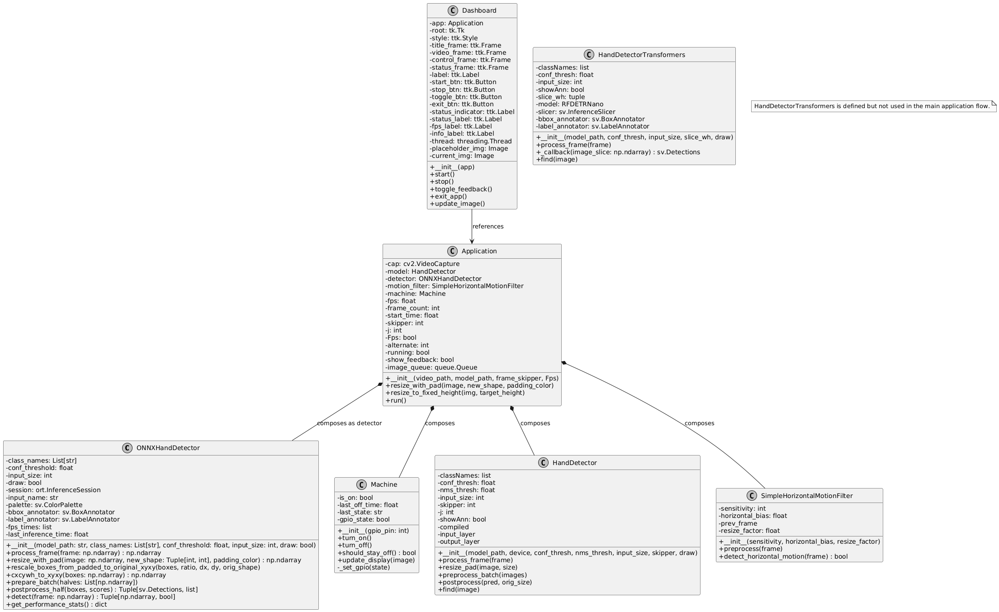
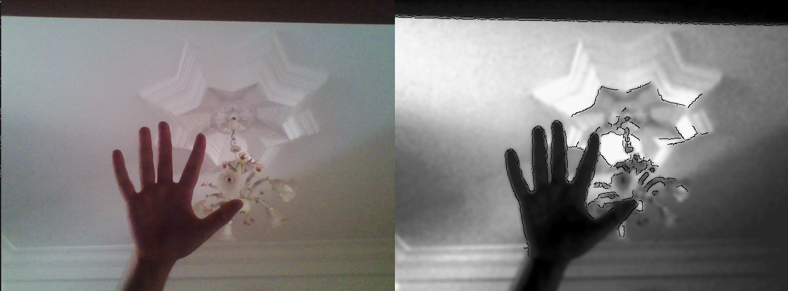

# 🖐️ Hand Detection for Industrial Safety  
**Hybrid YOLOv11 + RF-DETR Pipeline with Motion-Aware Safety Control**  

🚨 *Reinventing Industrial Safety with YOLOv11 + RF-DETR: Edge AI that Sees What Mediapipe Misses* 🚨  

---

## 📌 Overview
This project presents a **real-time AI-based safety system** designed to protect operators from press machine injuries.  
Developed during a **2-month internship at Hutchinson**, the system leverages **motion-aware frame filtering + hybrid detectors (YOLOv11 + RF-DETR Nano)** to ensure **fail-safe machine shutdown**.  

Unlike MediaPipe (which fails with gloves, occlusions, and poor lighting), this pipeline combines:  
- **Motion detection** → stops the machine instantly if motion is present.  
- **YOLOv11 + RF-DETR** → validate safety when no motion is detected.  

---

## 📊 UML Class Diagram

  

---

## ⚙️ System Workflow
1. **Video Input** → Calibrated camera captures frames.  
2. **Motion Detection**  
   - Motion = 🚨 stop machine immediately (no inference needed).  
   - No motion = run detectors for safety validation.  
3. **Hybrid Detection**  
   - **YOLOv11 (OpenVINO)**: fast baseline detection.  
   - **RF-DETR Nano (ONNX)**: transformer-based refinement.  
4. **Safety Action**  
   - GPIO relay shutdown on Raspberry Pi.  
   - Alerts & visualization on PC dashboard.  

---

## 🔧 Technical Optimizations
### Motion-Aware Optimization
- Motion = stop machine instantly (skip model).  
- No motion = detectors decide presence/absence.  
- **Fail-safe + computational efficiency**.

### Preprocessing
- **Grayscale conversion**  
- **Histogram equalization**  
- **Quantization (32 levels)**  
- **Fisheye correction**  
- **Canny edges**  

📸 Example of preprocessing impact:  

    
  <em>Left: Raw input | Right: After preprocessing</em>

---

## 🧠 Training Results
Both models were trained on a **custom dataset (bare hands + gloves, multi-color background)**.

### YOLOv11 (OpenVINO export)
| Metric        | Value |
|---------------|-------|
| Precision     | 0.91  |
| Recall        | 0.88  |
| **mAP@50**    | **0.93** |
| FPS (Pi 5)    | ~18   |

### RF-DETR Nano (ONNX export)
| Metric        | Value |
|---------------|-------|
| Precision     | 0.93  |
| Recall        | 0.90  |
| **mAP@50**    | **0.95** |
| FPS (Pi 5)    | ~9    |

📌 **Note**: For this application, **mAP@50** is the **key metric**.  
Bounding box precision at higher IoUs isn’t critical, since the system only needs to decide:  
➡️ **“Is there a hand in the scene or not?”**  

---

## 📊 Example Scenarios
| Condition               | System Behavior |
|--------------------------|-----------------|
| Motion detected          | 🚨 Machine stopped immediately (relay OFF / alert shown) |
| No motion + bare hands   | ✅ YOLO + RF-DETR detect and validate presence |
| No motion + gloves       | ✅ Preprocessing improves detection robustness |
| No motion + poor lighting| ✅ Histogram equalization stabilizes accuracy |
| No motion + occlusion    | ✅ RF-DETR refinement reduces misses |

---

## 🎥 Demo
👉 [Watch the Demo Video](https://your-demo-link.com)  
*(shows: bare hands, gloves, poor lighting, motion-triggered stop, and dashboard monitoring)*  

---

## 📜 Technical Contributions
- Motion-triggered fail-safe inference pipeline.  
- Hybrid YOLOv11 + RF-DETR architecture.  
- Preprocessing that enhances detection robustness.  
- OpenVINO & ONNX conversion for edge deployment.  
- Dashboard for real-time monitoring.  

---

## 🙏 Acknowledgments
- Internship project @ **Hutchinson**  
- Models: **Ultralytics YOLOv11** + **RF-DETR Nano**  
- Optimized with **OpenVINO, ONNX Runtime, OpenCV**  
- Inspired by **real-world industrial safety challenges**  

---
